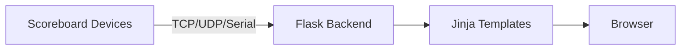

# Flask Virtual Scoreboard

Tags: #project #status/active #todo

## Overview
Flask service that ingests live scoreboard packets (serial, TCP, UDP) and renders sport-specific scoreboards in a browser. Parsing logic matches the legacy desktop app and uses packet-length guards for shared packet types. Optional TrackMan UDP feeds provide pitch/hit metrics for baseball/softball.

Secure config lives in `.env` (see `.env.example` for required variables).

## Session Summary
- Rebuilt sport UIs with a dark UNC-themed design, large clock emphasis, and sport-specific stat layouts.
- Added dynamic line scores for baseball/softball (extra innings supported) and prominent B/S/O presentation.
- Added TrackMan UDP configuration, parsing, and dashboard tiles (Baseball/Softball) plus raw debug output.
- Added Gymnastics placeholder page and updated navigation.
- Reduced polling to 150ms with no-cache fetches for live clock accuracy.

## Roadmap / Next Steps
- Validate TrackMan feed values against live stadium output and map additional metrics (break, release height, bearing).
- Add retention/cleanup for stale sources to avoid growth over long runtimes.
- Confirm inning/top-bot derivation for baseball/softball against real game flow.

## TODOs
- Confirm Football/Volleyball/Soccer/Wrestling packet lengths from the legacy app and enforce exact matches.
- Add admin protection for `/update_server_config` if exposed beyond trusted networks.
- Add TrackMan metric units/labels for any additional fields once feeds are verified.

## Project Structure
- `main.py` — Flask entry point, TCP/UDP/serial ingestion, parsing, API.
- `website/` — Flask blueprints and templates.
- `website/Templates/` — Sport pages and base layout.
- `docs/` — Architecture, infrastructure, decisions, issues, changelog.

## Diagrams
Diagram needed.

## Related Docs
- [[architecture]]
- [[infrastructure]]
- [[decisions]]
- [[known-issues]]
- [[CHANGELOG]]
