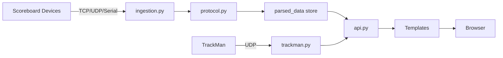

# Flask Virtual Scoreboard

Tags: #project #status/active #todo

## Overview
Flask service that ingests live scoreboard packets (serial, TCP, UDP) and renders sport-specific scoreboards in a browser. Modular architecture with 5 backend modules, 47 tests, and systemd deployment for Ubuntu. Optional TrackMan UDP feeds provide pitch/hit metrics for baseball/softball.

Repo: https://github.com/furrymayo/unc-virtual-score-server
Secure config lives in `.env` (see `.env.example` for required variables).

## Session Summary (2026-02-16)
- Refactored 1527-line `main.py` monolith into 5 modules: `protocol.py`, `ingestion.py`, `trackman.py`, `api.py`, `sports.py`.
- Added 47 pytest tests, systemd deployment config, README with full deploy guide.
- Fixed innerHTML XSS, converted thread-stop bools to Events, added stale source cleanup.
- Pushed to new GitHub repo (`unc-virtual-score-server`), deployed to Ubuntu test server.

## Session Summary (2026-02-14)
- Rebuilt sport UIs with a dark UNC-themed design, large clock emphasis, and sport-specific stat layouts.
- Added dynamic line scores for baseball/softball (extra innings supported) and prominent B/S/O presentation.
- Added TrackMan UDP configuration, parsing, and dashboard tiles (Baseball/Softball) plus raw debug output.
- Added Gymnastics placeholder page and updated navigation.
- Reduced polling to 150ms with no-cache fetches for live clock accuracy.

## Roadmap / Next Steps
- Validate TrackMan feed values against live stadium output and map additional metrics.
- Confirm inning/top-bot derivation for baseball/softball against real game flow.
- Add admin protection for API endpoints if exposed beyond trusted networks.
- Confirm Football/Volleyball/Soccer/Wrestling packet lengths from the legacy app.

## Project Structure
```
main.py                  — Slim entry point (~12 lines)
website/
  __init__.py            — App factory, registers 3 blueprints
  views.py               — Home page route
  sports.py              — Sport page routes
  api.py                 — 9 API routes (Blueprint)
  protocol.py            — Serial protocol parser, decoders, sport parsers
  ingestion.py           — Data store, serial/TCP/UDP readers, source mgmt
  trackman.py            — TrackMan state, parser, UDP listener
  Templates/             — Jinja2 HTML templates
tests/                   — 47 pytest tests
deploy/                  — systemd unit file
docs/                    — Architecture, infrastructure, decisions, issues
```

## Diagrams



## Related Docs
- [[architecture]]
- [[infrastructure]]
- [[decisions]]
- [[known-issues]]
- [[CHANGELOG]]
