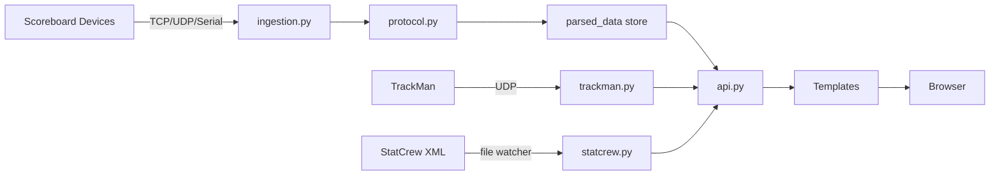

# Flask Virtual Scoreboard

Tags: #project #status/active #todo

## Overview
Flask service that ingests live scoreboard packets (serial, TCP, UDP) and renders sport-specific scoreboards in a browser. Modular architecture with 6 backend modules, 50+ tests, and systemd deployment for Ubuntu. Supports TrackMan UDP for pitch/hit tracking and StatCrew XML for enhanced game stats.

**Gymnastics special case**: The OES controller has no Gymnastics sport code, so the gymnastics venue transmits using the Lacrosse packet type. We use per-source `sport_overrides` to remap Lacrosse packets to Gymnastics for that venue, and only the running clock is consumed for Gymnastics.

Repo: https://github.com/furrymayo/unc-virtual-score-server
Secure config lives in `.env` (see `.env.example` for required variables).

## Session Summary (2026-02-17)
- **StatCrew XML Integration**: Added `statcrew.py` module with XML parser and file watcher thread. Parses venue, teams, players, and stats from StatCrew files.
- **Baseball Page Redesign**: Team names/records from StatCrew, stadium/weather display, current pitcher/batter cards with stats, center-stacked layout.
- **Strike Zone Fix**: Corrected coordinate mapping — now uses Z (height) instead of Y (depth). Removed incorrect xOffset/xScale values.
- **New APIs**: `/statcrew_config/<sport>`, `/get_statcrew_data/<sport>`, `/browse_files` for server-side file selection.
- **StatCrew Network Share**: Added CIFS mount instructions to README for persistent network share at `/mnt/stats` on the Ubuntu server. Credentials stored securely in `/etc/credentials-statcrew` (see README for setup). StatCrew XML files are browsable from the app's config UI.
- **Pending**: Strike zone calibration needs verification with live TrackMan data (check `/get_trackman_debug/Baseball`).

## Session Summary (2026-02-16)
- Refactored 1527-line `main.py` monolith into 5 modules: `protocol.py`, `ingestion.py`, `trackman.py`, `api.py`, `sports.py`.
- Added 47 pytest tests, systemd deployment config, README with full deploy guide.
- Fixed innerHTML XSS, converted thread-stop bools to Events, added stale source cleanup.
- Pushed to new GitHub repo (`unc-virtual-score-server`), deployed to Ubuntu test server.

## Session Summary (2026-02-14)
- Rebuilt sport UIs with a dark UNC-themed design, large clock emphasis, and sport-specific stat layouts.
- Added dynamic line scores for baseball/softball (extra innings supported) and prominent B/S/O presentation.
- Added TrackMan UDP configuration, parsing, and dashboard tiles (Baseball/Softball) plus raw debug output.
- Added Gymnastics placeholder page and updated navigation.
- Reduced polling to 150ms with no-cache fetches for live clock accuracy.

## TODOs
- [ ] **Verify strike zone calibration** with live TrackMan data (X/Z coordinates)
- [ ] **Verify CIFS mount** on Ubuntu server — confirm StatCrew XMLs visible via app file browser
- [ ] Add StatCrew data sources panel to remaining sport pages (Basketball, Hockey, etc.)
- [ ] Validate TrackMan feed values against live stadium output
- [ ] Add admin protection for API endpoints if exposed beyond trusted networks

## Roadmap / Next Steps
- ~~Validate TrackMan feed values against live stadium output and map additional metrics.~~ *Partially done: coordinate system documented, needs live verification*
- Confirm inning/top-bot derivation for baseball/softball against real game flow.
- Add admin protection for API endpoints if exposed beyond trusted networks.
- Confirm Football/Volleyball/Soccer/Wrestling packet lengths from the legacy app.

## Project Structure
```
main.py                  — Entry point, starts app + background threads
website/
  __init__.py            — App factory, registers 3 blueprints
  views.py               — Home page route
  sports.py              — Sport page routes
  api.py                 — 12 API routes (Blueprint)
  protocol.py            — Serial protocol parser, decoders, sport parsers
  ingestion.py           — Data store, serial/TCP/UDP readers, source mgmt
  trackman.py            — TrackMan state, parser, UDP listener
  statcrew.py            — StatCrew XML parser, file watcher thread
  Templates/             — Jinja2 HTML templates
tests/                   — 50+ pytest tests
deploy/                  — systemd unit file
docs/                    — Architecture, infrastructure, decisions, issues
examples/                — Sample StatCrew XML file
```

## Diagrams



### TrackMan Coordinate System
| Axis | Direction | Range |
|------|-----------|-------|
| X | Horizontal (left/right) | -1.5 to +1.5 ft |
| Y | Depth (toward pitcher) | ~1.8 ft |
| Z | Vertical height | 1.0 to 4.5 ft |

## Related Docs
- [[architecture]]
- [[infrastructure]]
- [[decisions]]
- [[known-issues]]
- [[CHANGELOG]]
